# Sistema Intelligente di Gestione Dolore e Recupero Motorio

## Filosofia: Non "Compitini", Ma Sistema Scientifico

> **"Non puoi pensare di far fare quei tre esercizi per TUTTI i mal di schiena. Abbiamo creato quel bel file sui movimenti anatomici per poi ridurci a fare il compitino? Eh no!! Iniziamo a pensare come me."**

## 🎯 Sistema a DUE SCENARI - Intelligente e Contestuale

Il sistema distingue tra dolore che emerge **DURANTE** l'allenamento vs dolore **GIÀ PRESENTE** all'inizio:

---

### 📊 SCENARIO 1: Dolore DURANTE l'Allenamento

**Situazione**: Cliente sta allenandosi, esercizio causa dolore ≥5/10

**Risposta**: Progressive Deload (dare al corpo chance di adattarsi)

```
1. RIDUZIONE CARICO (-20%)
   ↓ Ancora dolore?
2. RIDUZIONE RIPETIZIONI (-30%)
   ↓ Ancora dolore?
3. SOSPENSIONE ESERCIZIO (marca 1° sospensione)
   ↓ Succede 2a VOLTA?
4. FUNCTIONAL SCREENING → Recovery Protocol Specifico
```

**Logica**: Dolore acuto durante workout può essere:
- Carico eccessivo → riduci carico
- Volume eccessivo → riduci reps
- Esercizio inappropriato → sospendi e valuta

### 🚨 SCENARIO 2: Dolore GIÀ PRESENTE Pre-Workout

**Situazione**: Cliente arriva alla sessione CON dolore (prima ancora di iniziare)

**Risposta**: Recovery Motorio Immediato (NON stressare ulteriormente)

```
1. PRE-WORKOUT PAIN CHECK
   ↓ Cliente indica dolore?
2. SALTA progressive deload
   ↓
3. ATTIVA SUBITO Recovery Protocol
   ↓ Identifica aree dolorose
4. FUNCTIONAL SCREENING specifico per area
   ↓ Esercizi correttivi movement-specific
5. MONITORA PROGRESSO
   ↓ Dolore persiste dopo recovery?
6. REFERRAL A FISIOTERAPISTA
```

**Logica**: Dolore pre-esistente indica:
- Problema non acuto ma persistente
- Non causato da workout corrente
- Necessita recupero, non stress aggiuntivo
- Se recovery fallisce → serve valutazione professionale

---

### 🔄 Differenze Chiave Tra Scenari

| Aspetto | Scenario 1 (Durante) | Scenario 2 (Pre-workout) |
|---------|---------------------|--------------------------|
| **Trigger** | Dolore emerge durante esercizio | Dolore già presente all'arrivo |
| **Approccio** | Progressive deload (3 step) | Recovery immediato (0 step) |
| **Obiettivo** | Trovare intensità tollerabile | Evitare stress aggiuntivo |
| **Tempistica** | Graduale (3 tentativi) | Immediata (nessun tentativo) |
| **Screening** | Dopo 2° sospensione | Subito se dolore presente |
| **Filosofia** | "Può essere troppo carico" | "Corpo già in difficoltà" |

---

## 📋 Implementazione Tecnica

### Componenti Creati

1. **`PreWorkoutPainCheck.tsx`**
   - Modal all'inizio sessione
   - "Hai dolore in qualche parte del corpo ADESSO?"
   - Se SÌ → Selezione aree dolorose
   - Attiva recovery immediato (Scenario 2)

2. **`usePainManagement.ts`** (Hook)
   - Traccia storia dolore per esercizio
   - Implementa progressive deload (Scenario 1)
   - Conta sospensioni per trigger screening
   - Gestisce referral fisioterapista

3. **`PhysioReferralModal.tsx`**
   - Mostra quando recovery fallisce
   - Lista aree/esercizi problematici
   - Link trova fisioterapista
   - Download report dettagliato

4. **`FunctionalScreeningModal.tsx`** (già esistente)
   - 10 segmenti corporei
   - 74 test funzionali
   - Video demonstrations
   - Movement-specific assessment

5. **`movementSpecificCorrectiveExercises.ts`** (già esistente)
   - ~150 esercizi correttivi
   - Specifici per movimento anatomico
   - Rationale scientifico per ognuno

---

## 🔬 Esempi Pratici Dettagliati

### SCENARIO 1: Squat Causa Dolore Durante Workout

```typescript
// GIORNO 1: Squat set 1 → dolore 6/10
reportPain('Back Squat', 6)
→ Sistema: "🔽 Riduciamo il carico del 20%. Riprova."
→ Action: reduce_load (-20%)
→ Utente: Squat con 64kg invece di 80kg

// Squat set 2 (64kg) → ancora dolore 5/10
reportPain('Back Squat', 5)
→ Sistema: "🔽 Riduciamo le ripetizioni del 30%. Riprova."
→ Action: reduce_reps (-30%)
→ Utente: 7 reps invece di 10 reps

// Squat set 3 (64kg, 7 reps) → ancora dolore 5/10
reportPain('Back Squat', 5)
→ Sistema: "⏸️ SOSPESO per oggi. Se capita ancora, faremo screening."
→ Action: suspend
→ Suspension count: 1

// GIORNO 2: Squat → dolore 6/10 (SECONDA VOLTA)
reportPain('Back Squat', 6)
→ Sistema: "🔍 2° sospensione! Attiviamo functional screening."
→ Action: screening
→ needsScreening('Back Squat') === true

// → FUNCTIONAL SCREENING per lower_back
<FunctionalScreeningModal
  painArea={getPainAreaFromExercise('Back Squat')} // 'lower_back'
  onComplete={(profile) => {
    // profile.pain_patterns = ['spinal_flexion']
    // → Dolore in forward bend (flexion intolerant)
    // → Sistema ritorna: Extension exercises (McKenzie press-ups, Bird Dog)
  }}
/>
```

### SCENARIO 2: Cliente Arriva Già con Dolore Collo

```typescript
// INIZIO SESSIONE
<PreWorkoutPainCheck
  onComplete={(result) => {
    if (result.hasPain) {
      // result.painAreas = ['neck']
      // result.shouldActivateRecovery = true

      // SALTA workout normale
      // ATTIVA screening immediato

      <FunctionalScreeningModal
        painArea="neck"
        onComplete={(profile) => {
          // profile.pain_patterns = ['cervical_extension']
          // → Dolore looking up (extension intolerant)
          // → Sistema ritorna: Cervical flexion stretch, Deep neck flexor strengthening

          // SESSIONE DIVENTA:
          // 1. Chin tucks 3x10
          // 2. Cervical flexion stretch 3x30s
          // 3. Deep neck flexor strengthening 3x10
          // NO overhead press
          // NO altri esercizi che stressano collo
        }}
      />
    } else {
      // Procedi con workout normale
    }
  }}
/>

// SE DOPO 2-3 SESSIONI RECOVERY DOLORE PERSISTE
markForPhysioReferral('neck', 'Dolore cervicale persiste dopo 3 sessioni recovery')
→ Sistema: "Rimanda a fisioterapista"

<PhysioReferralModal
  painAreas={['neck']}
  exercisesAffected={['Overhead Press', 'Pull-ups']}
  onClose={() => {}}
/>
```

---

## 🔄 Flow Completo Sistema

### Flow Scenario 1 (Durante Workout)


### Flow Scenario 2 (Pre-Workout)


---

## 💻 Integrazione Codice

### Hook Usage in LiveWorkoutSession

```typescript
import { usePainManagement } from '../hooks/usePainManagement';
import PreWorkoutPainCheck from './PreWorkoutPainCheck';
import FunctionalScreeningModal from './FunctionalScreeningModal';
import PhysioReferralModal from './PhysioReferralModal';

function LiveWorkoutSession() {
  const {
    reportPain,
    needsScreening,
    getPainAreaFromExercise,
    markForPhysioReferral,
    activeScreeningExercise,
    physioReferralNeeded
  } = usePainManagement();

  const [showPreCheck, setShowPreCheck] = useState(true);
  const [preWorkoutPainAreas, setPreWorkoutPainAreas] = useState<string[]>([]);
  const [showScreening, setShowScreening] = useState(false);
  const [screeningArea, setScreeningArea] = useState<string | null>(null);

  // SCENARIO 2: Pre-workout check
  const handlePreWorkoutCheck = (result: any) => {
    setShowPreCheck(false);

    if (result.shouldActivateRecovery) {
      // Dolore già presente → Recovery immediato
      setPreWorkoutPainAreas(result.painAreas);
      setScreeningArea(result.painAreas[0]); // Primary area
      setShowScreening(true);
    }
    // else: procedi normale
  };

  // SCENARIO 1: Durante workout, post-set pain check
  const handlePostSetPain = (exerciseName: string, painLevel: number) => {
    const result = reportPain(exerciseName, painLevel);

    if (result.action === 'reduce_load') {
      alert(`🔽 ${result.message}`);
      // UI: Reduce weight by 20%
    } else if (result.action === 'reduce_reps') {
      alert(`🔽 ${result.message}`);
      // UI: Reduce reps by 30%
    } else if (result.action === 'suspend') {
      alert(`⏸️ ${result.message}`);
      // UI: Skip this exercise
    } else if (result.action === 'screening') {
      alert(`🔍 ${result.message}`);
      setScreeningArea(getPainAreaFromExercise(exerciseName));
      setShowScreening(true);
    }
  };

  // Screening completato
  const handleScreeningComplete = (profile: any) => {
    setShowScreening(false);
    // Aggiungi corrective exercises basati su profile.pain_patterns
    const correctiveExercises = getMovementSpecificCorrectiveExercises(
      screeningArea,
      profile.pain_patterns[0]
    );
    // Add to workout
  };

  return (
    <>
      {/* SCENARIO 2: Pre-workout check */}
      {showPreCheck && (
        <PreWorkoutPainCheck
          onComplete={handlePreWorkoutCheck}
          onSkip={() => setShowPreCheck(false)}
        />
      )}

      {/* Functional Screening (entrambi scenari) */}
      {showScreening && screeningArea && (
        <FunctionalScreeningModal
          painArea={screeningArea as any}
          onComplete={handleScreeningComplete}
          onClose={() => setShowScreening(false)}
        />
      )}

      {/* Physio Referral */}
      {physioReferralNeeded.length > 0 && (
        <PhysioReferralModal
          painAreas={physioReferralNeeded}
          exercisesAffected={physioReferralNeeded}
          onClose={() => {}}
        />
      )}

      {/* Workout UI */}
      {/* ... */}
    </>
  );
}
```

---

## 📊 Statistiche Sistema Completo

**Componenti**: 5 (PreWorkoutPainCheck, usePainManagement, PhysioReferralModal, FunctionalScreeningModal, CorrectiveExercises)

**Body Coverage**: 10/10 segmenti corporei

**Tests Funzionali**: 74 test scientifici

**Esercizi Correttivi**: ~150 movement-specific

**Scenari Gestiti**: 2 (Durante workout + Pre-workout)

**Safety Net**: Referral fisioterapista se recovery fallisce

**Principi**: McKenzie, McGill, FMS, Evidence-based

---

## ✅ Benefici Sistema Completo

1. **Contestuale**: Risposta diversa basata su QUANDO dolore emerge
2. **Progressivo**: Non va subito a "stop", scala intelligentemente (Scenario 1)
3. **Protettivo**: Se dolore pre-esistente, NON rischia ulteriore danno (Scenario 2)
4. **Specifico**: Movement-specific exercises, non generici
5. **Sicuro**: Se recovery fallisce → professional medical referral
6. **Tracciabile**: Storia completa dolore per esercizio
7. **Educativo**: Utente capisce PERCHÉ ogni decisione

---

## 🚀 Next Steps Implementazione

1. ✅ PreWorkoutPainCheck component
2. ✅ usePainManagement hook
3. ✅ PhysioReferralModal component
4. ✅ Documentation aggiornata
5. ⏳ Integrazione in LiveWorkoutSession
6. ⏳ Testing flusso completo
7. ⏳ UI indicators per load/rep reductions

---

**Sistema Status**: ✅ **ARCHITETTURA COMPLETA & DOCUMENTATA**

Pronto per integrazione in LiveWorkoutSession.tsx
// Giorno 1: Squat causa dolore 5/10
→ Sistema: Riduco carico da 80kg a 64kg (-20%)

// Giorno 2: Squat ancora dolore 5/10
→ Sistema: Riduco reps da 10 a 7 (-30%)

// Giorno 3: Squat ancora dolore 5/10
→ Sistema: SOSPENDO Squat per oggi

// Giorno 4: Squat causa dolore 5/10 (SECONDA VOLTA sospeso)
→ Sistema: ATTIVO FUNCTIONAL SCREENING
```

## 🔬 Functional Screening - Identificazione Pattern di Dolore

### Non Generici, Ma Specifici

**SBAGLIATO** ❌:
```typescript
// "3 esercizi per la schiena"
correctives = ['Cat-Cow', 'Bird Dog', 'Dead Bug']
```

**CORRETTO** ✅:
```typescript
// TEST FUNZIONALE: Quale movimento fa male?
screeningResults = runLowerBackQuickScreen() // 6 test, 5-7 minuti

// INTERPRETAZIONE:
if (flexionPain && !extensionPain) {
  directional_preference = 'extension'
  correctives = LOWER_BACK_CORRECTIVES.spinal_flexion
  // → McKenzie Press-ups, Prone Cobra, Bird Dog (anti-flexion)
}

else if (extensionPain && !flexionPain) {
  directional_preference = 'flexion'
  correctives = LOWER_BACK_CORRECTIVES.spinal_extension
  // → Cat-Cow (flexion emphasis), Child's Pose, Dead Bug (anti-extension)
}

else if (rotationPain) {
  directional_preference = 'neutral'
  correctives = LOWER_BACK_CORRECTIVES.spinal_rotation
  // → Pallof Press (anti-rotation), Side Plank, Quadruped Thoracic Rotation
}
```

## 📋 Lower Back Quick Screen (5-7 minuti)

### Test Eseguiti

1. **Standing Forward Bend** → `spinal_flexion`
2. **Standing Extension** → `spinal_extension`
3. **Seated Trunk Rotation (R/L)** → `spinal_rotation_right/left`
4. **Single Leg Standing (R/L)** → `neutral_spine_isometric`

### Output

```typescript
MovementProfile {
  pain_patterns: ['spinal_flexion'],  // Movimento doloroso
  directional_preference: 'extension', // McKenzie approach
  severity: 'moderate',
  recommendations: [
    '🎯 EXTENSION DIRECTIONAL PREFERENCE detected (flexion intolerant).',
    'Perform McKenzie extensions (prone press-ups) 10 reps every 2-3 hours.',
    'Avoid all forward bending exercises initially.',
    'Use rack pulls, chest-supported rows instead of conventional deadlifts.'
  ],
  safe_exercises: [
    'Rack Pull (knee height)',
    'Trap Bar Deadlift',
    'Chest-Supported Row',
    'Plank',
    'Bird Dog'
  ],
  avoid_exercises: [
    'Conventional Deadlift (from floor)',
    'Good Morning',
    'Barbell Row (bent-over)',
    'Sit-ups'
  ]
}
```

## 🩹 Esercizi Correttivi Specifici per Movimento

### Lower Back - Flexion Intolerant

```typescript
LOWER_BACK_CORRECTIVES.spinal_flexion = {
  directional_preference: 'extension',
  exercises: [
    {
      name: 'McKenzie Press-ups',
      sets: '3', reps: '10', rest: '60s',
      purpose: 'Centralizza il dolore con estensione ripetuta (McKenzie Protocol)',
      cues: [
        'Prono, mani sotto le spalle',
        'Estendi le braccia mantenendo bacino a terra',
        'Rilassa i glutei, lascia la schiena iperestendere',
        'Ripeti lentamente, il dolore dovrebbe centralizzarsi'
      ]
    },
    {
      name: 'Prone Cobra',
      sets: '3', reps: '8', rest: '45s',
      purpose: 'Rinforza estensori toracici e lombari',
      cues: [
        'Prono, fronte a terra',
        'Solleva petto e braccia ruotando pollici verso l\'alto',
        'Attiva scapole e lombari',
        'Hold 3-5 secondi in cima'
      ]
    },
    {
      name: 'Bird Dog (Anti-flexion)',
      sets: '3', reps: '8/side', rest: '45s',
      purpose: 'Stabilità anti-flessione in posizione neutra',
      cues: [
        'Mantieni spine neutrale, NO flessione lombare',
        'Estendi braccio e gamba opposta senza ruotare bacino',
        'Focus su controllo, non su ROM'
      ]
    }
  ]
}
```

### Lower Back - Extension Intolerant

```typescript
LOWER_BACK_CORRECTIVES.spinal_extension = {
  directional_preference: 'flexion',
  exercises: [
    {
      name: 'Cat-Cow (Flexion Emphasis)',
      purpose: 'Mobilità flessione + decompressione vertebrale',
      cues: [
        'ESPIRAZIONE: arrotonda schiena (Cat)',
        'INSPIRAZIONE: ritorna neutrale (NO estensione)',
        'Enfatizza la flessione, limita l\'estensione'
      ]
    },
    {
      name: 'Child\'s Pose',
      purpose: 'Stretch passivo in flessione, riduce compressione posteriore',
      cues: [
        'Porta glutei verso talloni',
        'Braccia estese avanti, fronte a terra',
        'Respira profondo, rilassa lombari'
      ]
    },
    {
      name: 'Dead Bug',
      purpose: 'Stabilità anti-estensione',
      cues: [
        'Supino, lombare piatta a terra (NO arco!)',
        'Abbassa braccio e gamba opposta mantenendo lombare schiacciata',
        'Espirazione attiva durante il movimento'
      ]
    }
  ]
}
```

### Lower Back - Rotation Intolerant

```typescript
LOWER_BACK_CORRECTIVES.spinal_rotation_right = {
  directional_preference: 'neutral',
  exercises: [
    {
      name: 'Pallof Press (Anti-rotation)',
      purpose: 'Rinforza anti-rotazione, stabilizza colonna',
      cues: [
        'In piedi laterale a banda/cavo',
        'Mani al petto, estendi braccia SENZA ruotare busto',
        'Resisti alla rotazione, mantieni spalle quadrate'
      ]
    },
    {
      name: 'Side Plank',
      purpose: 'Stabilità laterale, previene rotazione eccessiva',
      cues: [
        'Gomito sotto spalla, corpo allineato',
        'NO rotazione bacino',
        'Attiva obliqui mantenendo allineamento'
      ]
    }
  ]
}
```

## 💡 Altre Aree - Esempi Specifici

### Hip - FAI (Femoroacetabular Impingement)

```typescript
HIP_CORRECTIVES.hip_flexion = {
  exercises: [
    {
      name: '90/90 Hip Stretch',
      purpose: 'Migliora rotazione interna e riduce impingement anteriore',
      cues: [
        'Seduto, gambe a 90° davanti e dietro',
        'Inclina busto in avanti mantenendo lordosi lombare',
        'Sentire stretch gluteo profondo'
      ]
    },
    {
      name: 'Clamshells',
      purpose: 'Rinforza rotatori esterni anca',
      cues: [
        'Decubito laterale, ginocchia piegate',
        'Apri ginocchio superiore come una conchiglia',
        'NO rotazione bacino'
      ]
    }
  ]
}
```

### Knee - Patellofemoral Pain

```typescript
KNEE_CORRECTIVES.patellofemoral_compression = {
  exercises: [
    {
      name: 'Spanish Squat',
      purpose: 'Riduce compressione patello-femorale del 30-40%',
      cues: [
        'Banda dietro ginocchia, ancorata posteriore',
        'Squat contro banda (banda tira tibia indietro)',
        'Riduce shear stress su rotula',
        'Hold isometrico in posizione confortevole'
      ]
    },
    {
      name: 'Terminal Knee Extension',
      purpose: 'Isola VMO (vasto mediale obliquo), stabilizza rotula',
      cues: [
        'In piedi, banda dietro ginocchio',
        'Estendi completamente ginocchio (ultimi 20°)',
        'Squeeze quadricipite in cima'
      ]
    }
  ]
}
```

### Shoulder - Impingement

```typescript
SHOULDER_CORRECTIVES.shoulder_flexion = {
  exercises: [
    {
      name: 'Face Pulls',
      purpose: 'Rinforza rotatori esterni + retrazione scapolare',
      cues: [
        'Cavo/banda altezza viso',
        'Tira verso viso aprendo gomiti',
        'Rotazione esterna in cima',
        'Squeeze scapole insieme'
      ]
    },
    {
      name: 'YTW Raises',
      purpose: 'Rinforza stabilizzatori scapola in pattern funzionali',
      cues: [
        'Y: braccia a 45° overhead',
        'T: braccia a 90° laterali',
        'W: gomiti piegati, retrazione scapolare'
      ]
    }
  ]
}
```

## 🔄 Flusso Completo del Sistema

```mermaid
graph TD
    A[Esercizio Causa Dolore ≥5] --> B{Prima Volta?}
    B -->|Sì| C[Riduzione Carico -20%]
    C --> D{Ancora Dolore?}
    D -->|Sì| E[Riduzione Reps -30%]
    E --> F{Ancora Dolore?}
    F -->|Sì| G[SOSPENDI Esercizio]
    G --> H[Marca: 1 sospensione]

    B -->|No, 2a volta| I[ATTIVA FUNCTIONAL SCREENING]
    I --> J[Lower Back Quick Screen: 6 test]
    J --> K[Interpreta Risultati]
    K --> L{Movimento Doloroso?}
    L -->|Flexion| M[Esercizi Extension Preference]
    L -->|Extension| N[Esercizi Flexion Preference]
    L -->|Rotation| O[Esercizi Anti-Rotation]
    L -->|Instability| P[McGill Big 3]
```



## 📊 Implementazione Tecnica

### File Creati

1. **`FunctionalScreeningModal.tsx`** - UI per eseguire test funzionali
2. **`movementSpecificCorrectiveExercises.ts`** - Database esercizi specifici
3. **`functionalScreening.ts`** (già esistente) - Protocolli screening

### Integrazione in LiveWorkoutSession

```typescript
// 1. Track dolore per esercizio
const painHistory = {
  'squat': {
    suspensions: 2,  // Sospeso 2 volte
    lastPain: 6,
    needsScreening: true
  }
};

// 2. Quando needsScreening = true
if (painHistory['squat'].needsScreening) {
  showFunctionalScreeningModal({
    painArea: 'lower_back',
    onComplete: (movementProfile) => {
      // 3. Usa risultati per esercizi specifici
      const painfulMovement = movementProfile.pain_patterns[0]; // es. 'spinal_flexion'
      const correctiveExercises = getMovementSpecificCorrectiveExercises('lower_back', painfulMovement);

      // 4. Aggiungi al programma
      addCorrectiveExercises(correctiveExercises);
    }
  });
}
```

## 🎓 Principi Scientifici

### McKenzie Directional Preference
- Flexion intolerant → Extension exercises
- Extension intolerant → Flexion exercises
- Centralizzazione del dolore come guida

### Spine Sparing (McGill)
- Evita movimenti dolorosi
- Rinforza in posizioni neutrali
- Big 3: Curl-up, Side Plank, Bird Dog

### Biomechanical Intelligence
- Analizza quale pattern di movimento fa male
- Non "mal di schiena generico"
- Intervento specifico basato su test funzionale

## ✅ Benefici del Sistema

1. **Precision**: Non "prova questi 3 esercizi", ma "hai dolore in QUESTO movimento, fai QUESTI esercizi"
2. **Evidence-Based**: McKenzie Protocol, McGill approach, FMS principles
3. **Progressivo**: Non salta subito a "riposo", scala gradualmente
4. **Tracciabile**: Sistema sa quando un esercizio è problematico
5. **Educativo**: Utente capisce PERCHÉ fa quegli esercizi specifici

## 🚀 Next Steps (Implementazione LiveWorkoutSession)

1. Aggiungere state per tracciare painHistory per esercizio
2. Implementare scala progressiva (carico → reps → sospendi)
3. Mostrare FunctionalScreeningModal dopo 2 sospensioni
4. Usare risultati screening per esercizi specifici
5. UI chiara che spiega il "PERCHÉ" di ogni esercizio

---

**Remember**: Non "compitini". Sistema scientifico che pensa come te. 🧠
